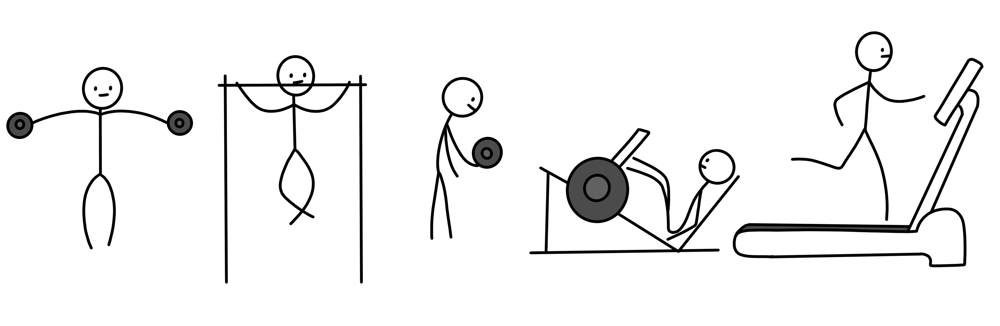

 

Embrace the rage! 

As much as I want to write a deep, heart-felt post on how the last couple of months have been, I often find it less dramatic and simple to convey the message over a bunch of illustrations and leave it up to the reader's interpretation.

 

Not too long ago, fair to say - I was living life to its fullest, from owning most things I could ask for, frequently traveling, living close to family, and sprinting up the career ladder. 

 
Although contradictory, nothing is more uncomfortable than the comfort zone; maybe I was settling for much less than I could achieve. But, after much thought, a master's degree in computer science seemed too good to be true; about two years, where a good amount of it to specialize in a subject I constantly get paid for, while I get enough time to work on things I value the most.

 
Fast forward, I moved to Canada and ate some good lobsters by the shore. My daily routine was packed with bouldering, top-roping, working out at the gym, and tutoring a broad range of topics in computer science, all of which gave me a sense of betterment. Not to mention, falling in love all over again made everything better.

 
Little did I know I would come across a series of maddening life events while in the struggles of cooking three healthy meals a day, working out, managing the coursework, working part-time, and having a social life. Especially when you come from a place of comfort, and now you have to do it all by yourself, missing home hits you like a truck.

The level of anxiety was insane; it was as if I was holding on to a cannonball in my chest, heavy, hard to move, and rugged. I slept for less than 3 hours a day, which got worse over time, and before I realized it, I had lost all the gains.

 
Felt like I got knocked out, got picked up, just to get knocked out harder, again and again. But this time, I knew exactly what was going on; here comes my favorite line from Rocky Balboa (2006):

"The world ain't all sunshine and rainbows. It's a very mean and nasty place and I don't care how tough you are it will beat you to your knees and keep you there permanently if you let it. You, me, or nobody is gonna hit as hard as life"

 
I took a break from all the extra work I had been doing and planned all the changes I would need to bring in. I soon started playing my favorite sports, hitting the gym, and making meal preps; things just got better and better. Believe it or not, I lost over 25 pounds in a matter of two and half months, and I'm constantly working towards getting shredded (Work in Progress).

 
So, what's the point of this post? Hit the gym! Physical health is strongly coupled with mental health. "gym" in this context is abstract, it could be playing a sport, dancing, or whatever; find yours and do it with all the love and discipline.

 

Yeah buddy, light weight baby
