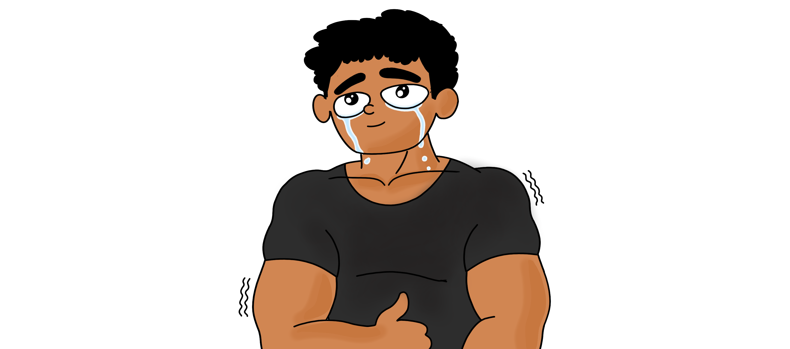

 

Hang in there! 

It's funny how I want to start the post with "after the pandemic," although it's been a while since covid is no longer a significant concern, fair to say it has had a long-lasting effect on our lives. 

Do you 
- often worry about things that are very unlikely to happen? 
- criticize yourself, but you are kind to others?
- have a wave of negative thoughts that things will turn out badly?
- overthink and procrastinate to either take a long time to act on it or avoid it altogether?
- have trouble sleeping because you can't stop thinking and get lost in the train of thoughts?

If you answered yes to more than one of these, you are likely dealing with some level of stress and anxiety. Although that doesn't mean it's doomsday but rather uncomfortable and irritable.  

And now, to break it down, identify the underlying problem, and look at probable solutions:

 1. Anxiety and Stress

Psychologists and researchers mostly define it as an emotional state characterized by feelings of tension, worried thoughts, and physical changes such as sweating, trembling, dizziness, or a rapid heartbeat. It's the human body's physical response to danger. And it's made up of three components: thoughts, feelings, and behaviors [1]. 

On the other hand, stress is not far apart and often co-related with anxiety; after all, it's the response our bodies have to any change, and it's not necessarily bad. The concern is when it's for a prolongated period. When we have less control over the situation creating the stress we are experiencing, our stress reaction is likely to be more intense. Over time, some common symptoms of untreated stress include headaches, skin breaks/rashes, forgetfulness, digestive issues, and lack of focus [5]. 

Before we get down to better understand the causes and solutions/exercises to "Rewire stress resilience and unwind anxiety." 

<h3>The top 3 changes in everyday lifestyle</h3> 

<ul>
<li> Cut down on coffee and energy drinks (caffeine); by cut down, I mean to reduce, of course. </li>
<li> Build a routine to include physical exercise, such as working out at the gym, running, swimming, or playing a sport, whichever is sustainable. </li>
<li> Get at least 6 hours of sleep every day; sleep deprivation is not only a symptom of anxiety but also a cause. </li>
</ul>

Although those 3 points came out of nowhere, I had to make sure to highlight these as they make an insanely significant difference in a relatively shorter period of time. 

 2. Rewire stress resilience

To better understand `Stress Response`, a quick overview of fight-or-flight and feed-and-breed response is a must:

The fight-or-flight response is an automatic physiological reaction to an event perceived as stressful or frightening (helps the body deal with threats). The perception of threat activates the sympathetic nervous system and triggers an acute stress response that prepares the body to fight or flee; the common signs are tense muscles, tight chest, pounding heart, cold sweats, the urge to run away/freeze, or just plain anger. 

Instead, what we want is the feed-and-breed response. The SNS (Sympathetic Nervous System) switches to fight-or-flight, and PNS (Parasympathetic Nervous System) activates the feed-and-breed response, like a braking system that lets us relax and slow down [2]. 

So, how do I activate feed-and-breed response instead of fight-or-flight? 

<h3>Box breathing exercise </h3>
<ul>
<li> Breathe in for 4 seconds </li>
<li> Hold your breath for 4 seconds </li>
<li> Breathe out for 4 seconds </li>
<li> Hold your lungs empty for 4 seconds </li>
<li> Repeat for 3-5 minutes. </li>
</ul>

<h3>Breakthrough bias exercise </h3>
<ul>
<li> Take a couple of deep breaths, concentrate on breathing and try not to get carried away with the stream of thoughts. </li>
<li> Now, look around, wherever you are, look at 5 different objects around you; it could be one of your gadgets, pictures, or even a lamp post, don't just glance, but observe individual objects one after the other. </li>
<li> Choose one object of your choice and zero in on it, focus on it, observe the colors, follow the shape, and imagine the texture. </li>
<li> Zoom out on the object and focus. Notice the changes in your body; does it feel more relaxed? Forehead and eyebrows relaxed, stomach and chest feel less tense, maybe? Observe any changes at all in your body. </li>
<li> Does it feel relaxed in several parts of your body? Take a couple of deep breaths again, stay in the zone for some more time, and get out of it when you feel like it in a few seconds or even minutes. </li>
</ul>

 3. Dealing with negative thoughts

Ever get into a loop of negative thoughts? So often, we consider these thoughts as facts, although they aren't rational in most cases. These untrue thoughts are called cognitive distortions and constantly fuel the inner critic (the inner voice within you affirming and stating untrue negative thoughts as if they are facts).

So, how do I reprogram negative thoughts?

<u>CBT (Cognitive Behavioral Therapy)</u> - usually involves efforts to change thinking patterns to understand and change negative perceptions/thoughts [3].

<h3>Fact check exercise </h3>
<ul>
<li> Try to corner down and identify the common negative thoughts. </li>
<li> Now, take one of them and try to reason it with logic. Is there enough evidence to make that claim? If so, is there a possible explanation or circumstance for it? </li>
<li> Form an alternative explanation for these thoughts that makes sense to you. </li>
</ul>

The key here is to fact-check, give a rational perspective and defend your alternative thinking.

<u>CFT (Compassion Focused Therapy)</u> - is more about finding the root cause or the source of distress and observing it without any judgments. From there, it's only a matter of figuring out what needs to be done to make it right.

<h3>Inner Coach Excercise </h3>

Adding more points to the fact-check exercise.

Have a debate with yourself; this time, defend the negative thought, and you'll likely see the inner critic show up (you get to understand the presence of the inner critic better); now, defend the alternative thought with logical reasoning, consider this to be your inner coach/cheerleader.

The alternative thought is not just a bunch of positive stuff said with affirmation. Instead, have a proper conversation, and experience a back-and-forth between the inner critic and the inner coach for a psychological shift in "thinking patterns." [4]

Last but not the least 

 4. Meditation

- Yet to add this section :P

 5. References

<pre><code>
[1] American Psychological Association, “Anxiety,” American Psychological Association, 2022. [Online]. Available: https://www.apa.org/topics/anxiety
[2] L. K. McCorry, “Physiology of the Autonomic Nervous System,” American Journal of Pharmaceutical Education, vol. 71, no. 4, p. 78, Sep. 2007, doi: 10.5688/aj710478.
[3] American Psychological Association, “What Is cognitive behavioral therapy?,” American Psychological Association, Jul. 2017. [Online]. Available: https://www.apa.org/ptsd-guideline/patients-and-families/cognitive-behavioral
[4] “How To Silence Your Inner Critic | BetterHelp,” www.betterhelp.com. https://www.betterhelp.com/advice/self-esteem/how-to-silence-your-inner-critic/ (accessed Nov. 15, 2022).
[5]“What Is The Difference Between Stress And Anxiety? | BetterHelp,” www.betterhelp.com. https://www.betterhelp.com/advice/stress/what-is-the-difference-between-stress-and-anxiety (accessed Nov. 16, 2022).
</code></pre>

This post is not intended to give medical advice and does not substitute professional help. It's based on my own research, understanding and personal experience that worked well for me, along with a bunch of friends and family :)

