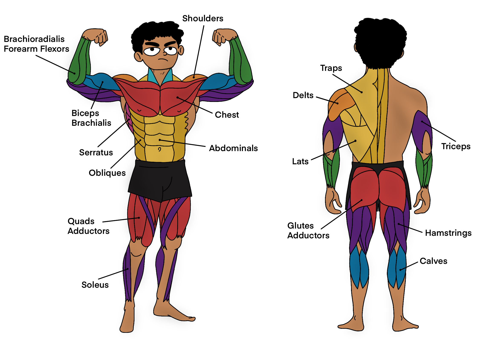

 

There's more to bro-split!

Greetings 🖖🏽 fellow coders! On the other side of all the tech in the world are software engineers who spend countless hours in front of their computers, diving deep into solving problems, and often feeling the strain of long, sedentary days. Early in my career, I thought grinding through hours of coding without breaks was the only way to get things done. But I’ve come to realize that staying physically active has made me a better programmer. Let’s talk about how fitness can transform your life as a software engineer.

<h3 id="turning-point">The Turning Point</h3>

Picture this: you're buried in a particularly challenging project, pulling late nights, surviving on coffee and takeout, and spending most of your days glued to your chair. Eventually, it starts to take a toll. You feel constantly tired, your back hurts, and your mind is always foggy. Sound familiar? Something has to change - RIGHT NOW! 😵‍💫

<h3 id="discovery-point">The Discovery</h3>

One day, a friend might convince you to join them for a morning run or an evening workout. At first, it seems like a crazy idea. How could running possibly help with coding? But after that first run, you might feel surprisingly refreshed. Your mind feels clearer, and you feel more energized than you have in weeks.

Start running regularly, and soon, you notice significant changes. Your focus improves, and you can solve problems more efficiently. It's like your brain is firing on all cylinders. The exercise sharpens your cognitive abilities, making it easier to learn new concepts and tackle complex algorithms.

<h3 id="stating-active">Staying Active: A Secret Productivity Hack</h3>

We all know that sitting for hours on end isn't doing us any favors. After a long coding session, it's common to feel sluggish and drained. But incorporating regular exercise into your routine can make a huge difference, by huge, I mean astronomical 🚀

Take short, active breaks get a pull-up bar 🤫 during your workday. A quick walk around the block or a few minutes of stretching can do wonders. These breaks help you stay focused and productive throughout the day, preventing that mid-afternoon slump.

<h3 id="why-get-moving">Why Software Engineers Should Get Moving</h3>

So, why should we, as software engineers, prioritize fitness? Here are a few reasons based on experiences that many of us share:

Stress Buster: At times, coding can be super stressful, especially when deadlines are looming. Regular exercise helps manage stress much better. After a good workout, those stressors don’t seem as daunting.

Boosted Creativity: Some of the best ideas come while away from the desk. Whether on a run or taking a leisurely walk, being active seems to spark creativity. Perfect for brainstorming a new feature or solving a tricky problem.

Team Spirit: Playing team sports or joining group fitness classes can improve communication and teamwork skills. Great news for collaborating on projects at work.

<h3 id="fitting-busy-schedule">Fitting Fitness into a Busy Schedule</h3>

Finding time to exercise can be tough when busy coding, but it doesn’t have to be a chore. Here are some tips that have worked for many:

Set Small Goals: Start with manageable fitness goals and gradually build up. Begin with a 10-minute walk each day, and then increase as you feel more comfortable.

Do What You Love: Find an activity you enjoy, whether it’s hitting the gym 🏋🏽, rock climbing 🧗🏽‍♂️, yoga 🧘🏽, swimming 🏊🏼‍♀️, or even dancing 🏊🏼‍♀️. If it’s fun, you’re more likely to stick with it.

Active Breaks: Take short breaks throughout your day to stretch or take a quick walk. It’ll help you stay refreshed and focused.

Join a Community: Working out with others can make it more enjoyable and keep you motivated. Maybe there’s a local running group or a friend who wants to join for workouts.

So, there you have it! Better fitness really can lead to better programming. By keeping your body and mind in top shape, you’ll be ready to tackle any coding challenge that comes your way. Give it a try and see how getting active can improve your coding game.
