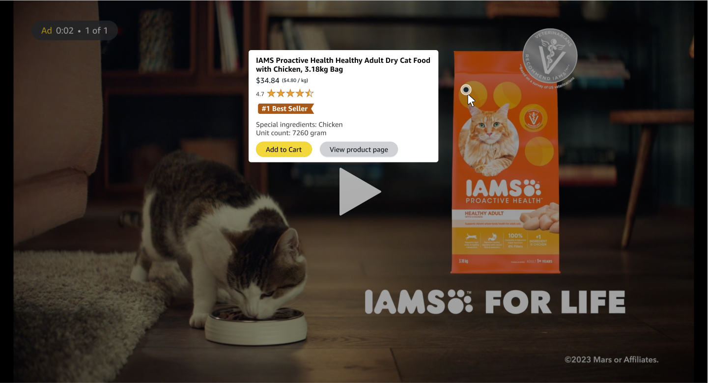

"Pause & Shop" on Prime Video combines the thrill of shopping with the joy of entertainment, redefining the boundaries of engagement.

Traditional streaming services often leave viewers with a fragmented experience. While engrossed in their favorite movies or shows, viewers frequently encounter products, costumes, or props that pique their interest, yet they lack an efficient means to explore or purchase these items. This disconnect results in missed opportunities for both consumers and brands alike, leaving audiences longing for a more integrated and streamlined approach to entertainment and commerce.

<h5> </h5>

 

Welcome to a new era of interactive entertainment and shopping integration, where every pause becomes an opportunity: "Pause & Shop" on Prime Video seamlessly bridges the gap between entertainment and e-commerce by empowering viewers to instantly explore and purchase products seen on screen. With just a simple pause, viewers can delve deeper into the world of their favorite movies or shows, discovering and acquiring featured items effortlessly. This innovative integration not only enhances the viewing experience but also opens up new avenues for brands to connect with their audience in a meaningful way.

<h5> </h5>

  

  
"Last weekend, my friends and I were watching a movie on Prime Video, and there was this stunning dress one of the characters wore that I absolutely fell in love with. Instead of scrambling to find it online later, I simply paused the movie and used the 'Pause & Shop' feature. Within minutes, I found the exact dress on Amazon and had it added to my cart. It was such a seamless experience! Prime Video not only entertained us but also made it incredibly easy to turn on-screen inspiration into real-life purchases. Can't wait to see what else I'll discover with this feature!"

    
<i>~ Alex R., Fashion Enthusiast and Prime Member</i>

  

<h5> </h5>

"Pause & Shop" on Prime Video revolutionizes the viewing experience by integrating interactive shopping directly into the platform. When users encounter intriguing products, costumes, or props during their viewing sessions, they can simply pause the content to explore further. A curated list of featured items appears on screen, allowing viewers to delve into product details, read reviews, and make purchases seamlessly via Amazon.com. This frictionless experience enhances user engagement and connects the moments of inspiration with action.

<h5> </h5>

 

<h5> </h5>

Risks, Mitigation Strategy and Alternatives

<b>Risks / Reasons for Not Implementing this Feature:</b>

Privacy Concerns: Introducing an interactive feature where users can identify and purchase products seen on screen may raise privacy concerns regarding data collection and tracking user preferences.

Distraction from Content: Introducing shopping features within the Prime Video interface may divert users' attention away from the primary purpose of the platform: enjoying movies and shows. Users might find themselves more focused on browsing products than immersing themselves in the storyline, leading to a disjointed viewing experience.

Cluttered Interface: Integrating shopping functionality into the Prime Video interface runs the risk of cluttering the user interface, potentially overwhelming users with additional elements such as product listings, advertisements, or purchase prompts. This clutter may detract from the clean and intuitive design that users expect from streaming platforms.

User Resistance: Some users may resist the integration of shopping features within a streaming service, perceiving it as an unwelcome intrusion into their leisure time. Resistance to the feature may stem from a desire to maintain a clear boundary between entertainment and commerce, with users preferring to shop on dedicated e-commerce platforms rather than within a video streaming environment.

Legal and Regulatory Considerations: If the feature raises legal or regulatory concerns, such as compliance with consumer protection laws or intellectual property rights, it may be prudent to reconsider implementation until these issues are addressed satisfactorily.

Technical Challenges: Implementing real-time product recognition technology to accurately identify items on screen may pose technical challenges, such as reliability and latency issues.

<b>Mitigation Strategy</b>

Transparent Privacy Policies: Implement transparent privacy policies that clearly communicate how user data will be collected, used, and protected. Provide users with options to control their privacy settings.

User-Centric Design Approach: Adopt a user-centric design approach to ensure that the integration of shopping features into Prime Video enhances, rather than disrupts, the viewing experience. Prioritize simplicity, intuitiveness, and unobtrusiveness in the design of the user interface to minimize distractions and maintain focus on the content.

Optimized Interface: Design the Prime Video interface in a way that effectively balances content and shopping elements, avoiding clutter and ensuring that browsing and purchasing products remains a seamless and non-intrusive experience. Employ techniques such as collapsible menus, subtle notifications, and unobtrusive overlays to present shopping options without overwhelming the user.

User Education and Customization: Provide users with educational resources and customization options to empower them to tailor their Prime Video experience according to their preferences. Offer features such as customizable settings for shopping notifications and personalized recommendations based on viewing habits to enhance user control and mitigate potential resistance to integrated shopping features.

By prioritizing user-centric design principles, optimizing the interface for simplicity and intuitiveness, and providing users with control over their experience, we can effectively mitigate the risks associated with the disruption of the viewing experience and ensure that the integration of shopping features enhances the overall Prime Video experience for our users.

<b>Alternatives</b>

Dedicated Shopping Section: Instead of integrating shopping directly into the Prime Video interface, create a separate section within the Amazon platform specifically for products featured in movies and shows. Users could access this section separately from their viewing experience, allowing them to explore and purchase related products without disrupting their entertainment.

Curated Product Recommendations: Implement a system for curating and promoting products related to movies and shows on Amazon.com based on user preferences and viewing history. Instead of integrating shopping directly into the viewing experience, leverage data analytics and recommendation algorithms to surface relevant products to users through personalized recommendations and targeted marketing campaigns.

Partnership with Content Creators: Forge partnerships with content creators and studios to create exclusive merchandise or limited-edition products tied to popular movies and shows available on Prime Video. Collaborate on promotional campaigns and marketing initiatives to drive sales of these products through traditional e-commerce channels while leveraging the Prime Video platform for increased visibility and exposure.

<b>Why is Amazon Uniquely Positioned</b> to implement this feature

Vast Product Catalog: Amazon offers an extensive catalog of products across various categories, ranging from electronics to fashion to home goods. Leveraging this vast selection of products, Prime Video can provide users with a diverse range of items featured in movies and shows, enhancing the relevance and appeal of the interactive shopping experience.

Data and Personalization: Amazon has robust data analytics capabilities and sophisticated recommendation algorithms that enable personalized experiences for users. By leveraging user data and viewing preferences, Prime Video can offer tailored product recommendations and curated lists of items relevant to each viewer's interests, increasing the likelihood of conversion and satisfaction.

Content Partnerships: Amazon Prime Video has established partnerships with content creators, studios, and distributors to offer a wide range of exclusive and licensed content to its subscribers. These partnerships provide opportunities to collaborate on integrated marketing campaigns and promotional initiatives that showcase products featured in popular movies and shows, driving traffic and sales to Amazon.com.

Prime Membership Benefits: Prime Video is part of the Amazon Prime subscription service, which offers additional benefits such as free shipping, exclusive deals, and access to other Amazon services like Prime Music and Prime Reading. Integrating shopping features into Prime Video enhances the value proposition of the Prime membership, incentivizing users to engage more deeply with the platform and reinforcing loyalty to the Amazon ecosystem.

<h5> </h5>

Frequently Asked Questions

<i>FAQ 1: What is "Pause & Shop"?</i>  
"Pause & Shop" is a groundbreaking feature on Prime Video that allows viewers to pause their favorite shows, movies or ads and instantly browse and purchase products that appear on screen directly from Amazon.com.

<i>FAQ 2: How does "Pause & Shop" work?</i>  
When viewers pause a movie or an ad on Prime Video, a curated list of products featured in the scene will appear on the screen. Users can then click on any product to view more details, read reviews, and seamlessly make a purchase through Amazon's secure checkout process.

<i>FAQ 3: What type of products can users purchase with "Pause & Shop"?</i>  
Users can purchase a wide range of products, including costumes worn by characters, props featured in scenes or ads, and other items that catch their eye during their viewing experience.

<i>FAQ 4: Is "Pause & Shop" available for all Prime Video content?</i>  
At launch, "Pause & Shop" will be available for select Prime Video titles. We're continually working to expand the feature to more content to offer our customers an even richer and more interactive viewing experience.

<i>FAQ 5: How does "Pause & Shop" benefit Prime members?</i>  
"Pause & Shop" enhances the Prime Video experience by providing a seamless way for viewers to engage with their favorite content and discover unique products inspired by the shows and movies they love. It offers added convenience, allowing users to shop for items they see on screen without interrupting their viewing experience.

<i>FAQ 6: Is "Pause & Shop" available on all devices?</i>  
"Pause & Shop" is currently available on select devices that support Prime Video. We're working to expand availability to more devices in the near future.

<i>FAQ 7: Is there any additional cost associated with using "Pause & Shop"?</i>  
No, "Pause & Shop" is included as part of the Prime membership at no additional cost. Prime members can enjoy this innovative feature as part of their existing subscription.

<i>FAQ 8: How can content creators and brands participate in "Pause & Shop"?</i>  
Content creators and brands interested in featuring their products on "Pause & Shop" can reach out to Amazon for partnership opportunities. We're excited to work with creators to enhance the viewing experience for our customers.

Please note that the information provided in this document represents a Proof of Concept (POC) for an innovative idea being explored. It's important to note that this document and its contents are not affiliated with Amazon in any way. Your feedback is appreciated as I refine and iterate on this concept.

 