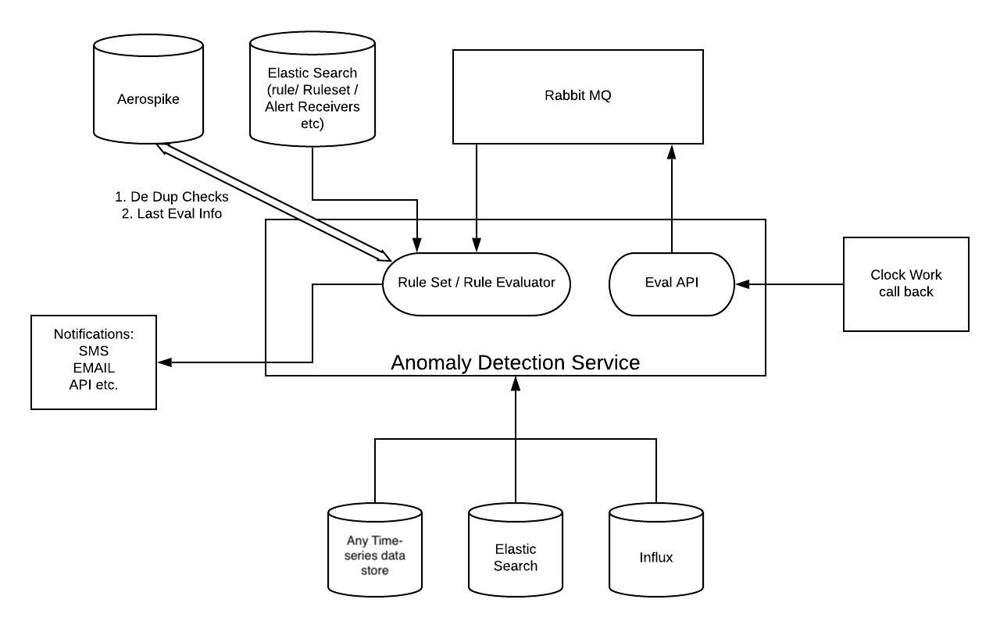

## What is Anomaly Detection Service

Anomaly Detection service is an alerting framework for configuring alerts on top of the influx database, or any other time-series data store.

## Anomalies can be categorized into 2 types:

- Absolute Anomaly: Anomaly is determined by absolute data values.
Example: (number of executions/ number of executions in progress) for the last 30 minutes.

- Relative Anomaly: Anomaly is determined from data relative to its previous day/month.
Example: Decrease in the number of customers buying a product during a time window (15 minutes, 1 hour, 1 day, etc) relative to the previous day/week.

## System design

 

Anomaly detection service system design.

### Components

- Elastic Search: Stores all data models needed for rule evaluation and alerting (Rule, Rulesets, alert receiver, and alert templates)
- Rabbit MQ: Used to queue eval requests and alert notifications.
- AeroSpike: Used for idempotency checks so that a rule is not evaluated for the same time interval twice. Also used to store the last eval info, used to trigger rule again in cases where the rule is not evaluated on schedule.
- Influx: Datastores from which metrics/events are fetched and rules are evaluated against those data.

### Evaluation of rules:

- Unique Identifier.
- Rule type (ABSOLUTE/RELATIVE).
- Time window – (SLIDING/TUMBLING).
- Validity Predicate – Returns a boolean to decide whether to continue rule execution.
- Alert Template – String template to be sent to alert receivers.
- Alert Receivers – (SMS/EMAIL/SLACK).
- Status – ACTIVE/INACTIVE.

The real-time event aggregates will be compared with the source/seed data to detect anomalies at the end of a time window.

(The seed data will be ingested into ES from the daily / weekly reports and older seed data will be dropped regularly, supports lookup of seed data from tenant ID – Unique key from the rule and time window, also supports aggregating data from multiple time windows to form a larger window).

Scheduler callbacks are received at the end of a time window which will trigger the rule evaluation (callback traffic load received are spread at the end of a time window for even distribution.)

Notifications will be sent when anomalies are detected between aggregate and source/seed data thresholds.