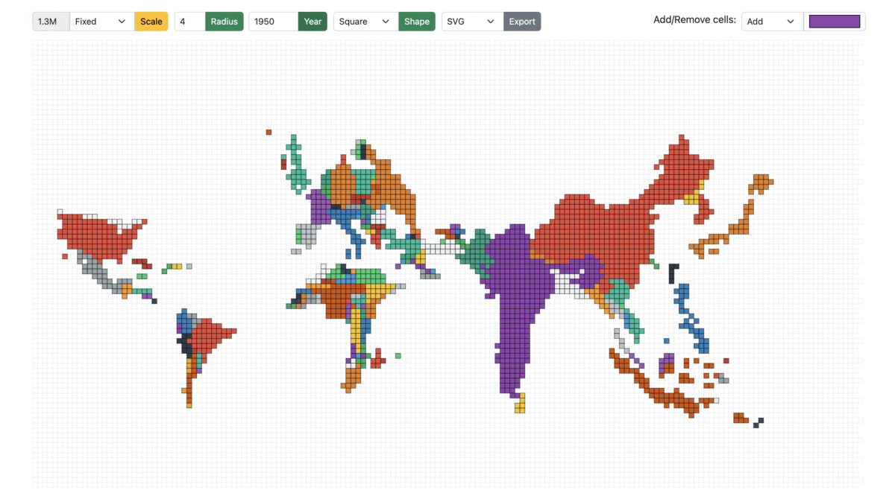

### Dependencies

```
"d3": "^7.4.3",
"d3-array": "^3.1.6",
"d3-geo": "^3.0.1",
"d3-hexbin": "^0.2.2",
"topojson-client": "^3.1.0",
"topojson-server": "^3.0.1",
"topojson-simplify": "^3.0.3"
```

<hr class="hr">

## Project Structure

The `core` module:
- `index.html`: HTML page of the main screen containing the root container and input form fields such as year, radius, scale mode, cell size, export format, and cell color selector.

- `cartogram.js`: Implementation of the algorithm to construct continuous area cartograms.

- `plot.js`: The logic for rendering the tessellated point-grid and plotting the cartogram based on the selected input fields.

- `shaper.js`: Functions dependent on the cell shape; the common pattern followed is to take decisions based on the cell shape using a switch case.

- `events.js`: All the mouse events in the application, such as single/double click, hover, and drag/drop.

### File: [index.html](https://github.com/owid/cartograms/blob/main/index.html)
### Create a HTML `div` with a unique `id`
To append SVG, i.e., the hexagonal grid and polygons/regions of the cartogram (derived from the topojson).

```html
<div class="container-fluid">
    <div id="container"></div>
</div>
```

<hr class="hr">

### File: [cartogram.js](https://github.com/owid/cartograms/blob/main/core/catogram.js)
The algorithm for generating a cartogram is a variant of continuous area cartograms by James A. Dougenik, Nicholas R. Chrisman, and Duane R. Niemeyer. 

The research paper: [An Algorithm to Construct Continous Area Cartograms](http://lambert.nico.free.fr/tp/biblio/Dougeniketal1985.pdf). Without getting into the exact details, line-by-line, the procedure to produce cartograms is as follows: 

### Calculate Force Reduction Factor

The "force reduction factor" is a number less than 1, used to reduce the impact of cartogram forces in the early iterations of the procedure. The force reduction factor is the reciprocal of one plus the mean of the size error. The size error is calculated by the ratio of area over the desired area (if area is larger) or desired area over area in the other case.

```
For each polygon
  Read and store PolygonValue (negative value illegal)
  Sum PolygonValue into TotalValue
```

```
For each iteration (user controls when done)
  For each polygon
	  Calculate area and centroid (using current boundaries)
  Sum areas into TotalArea
  For each polygon
	  Desired = (TotalArea * (PolygonValuelTotaIValue))
	  Radius = SquareRoot (Area / π)
	  Mass = SquareRoot (Desired / π) - SquareRoot (Area / π)
	  SizeError = Max(Area, Desired) / Min(Area, Desired)
```

### Move boundary co-ordinates

The brute force method (fixed small number of polygons): the forces of all polygons/countries act upon every boundary coordinate. As long as the number of polygons is relatively small (under 500), distortions can be computed for a rather complex line work (thousands of points). Furthermore, the computation of force effects could be restricted by implementing a search limitation to exclude infinitesimal forces from far-away polygons.

```
  ForceReductionFactor = 1 / (1 + Mean (SizeError))
  For each boundary line; Read coordinate chain
	  For each coordinate pair
		  For each polygon centroid
			  Find angle, Distance from centroid to coordinate
			    If (Distance > Radius of polygon): Fij = Mass * (Radius / Distance)
			    Else: Fij = Mass * (Distance^2 / Radius^2) * (4 - 3 * (Distance / Radius))
		  Using Fij and angles, calculate vector sum
		  Multiply by ForceReductionFactor
		  Move coordinate accordingly
	  Write distorted line to output and plot result
```

<hr class="hr">

### File: [plot.js](https://github.com/owid/cartograms/blob/main/core/plot.js)
### Create a point grid
A point grid is a matrix containing the centers of all the cells in the grid.

```javascript
  let cellRadius = cellDetails.radius;
  let cellShape = cellDetails.shape;
  
  let shapeDistance = getRadius(cellRadius, cellShape);
  let cols = width / shapeDistance;
  let rows = height / shapeDistance;
  let pointGrid = d3.range(rows * cols).map(function (el, i) {
    return {
      x: Math.floor(i % cols) * shapeDistance,
      y: Math.floor(i / cols) * shapeDistance,
      datapoint: 0,
    };
  });
```

The `shapeDistance` is different for different cell-shapes. For example:

```javascript
  switch (cellShape) {
      case cellPolygon.Hexagon:
        shapeDistance = radius * 1.5;
      case cellPolygon.Square:
        shapeDistance = radius * 2;
    }
```

 

### Plot the hexagonal grid playground
The playground of cells is as shown in Figure 8, where each point in the grid is tesselated with the respective cell shape. The playground also serves as the never-ending sea/ocean on the world map.

```javascript
  d3.select("#container").selectAll("*").remove();
    const svg = d3
      .select("#container")
      .append("svg")
      .attr("width", width + margin.left + margin.top)
      .attr("height", height + margin.top + margin.bottom)
      .append("g")
      .attr("transform", `translate(${margin.left} ${margin.top})`);

  svg
    .append("g")
    .attr("id", "hexes")
    .selectAll(".hex")
    .data(getGridData(cellShape, newHexbin, pointGrid))
    .enter()
    .append("path")
    .attr("class", "hex")
    .attr("transform", getTransformation(cellShape))
    .attr("d", getPath(cellShape, newHexbin, shapeDistance))
    .style("fill", "#fff")
    .style("stroke", "#e0e0e0")
    .style("stroke-width", strokeWidth)
    .on("click", mclickBase);
```
### File: [shaper.js](https://github.com/owid/cartograms/blob/main/core/shaper.js)

The `shaper.js` has all the code snippets that depend on the cells shape. 

Once again, the transformation, SVG path, and binned data points (grid) are dependent on the cell-shape.
For hexagons, the library used: [d3-hexbin](https://github.com/d3/d3-hexbin)

```javascript
  function getGridData(cellShape, bin, grid) {
    switch (cellShape) {
      case cellPolygon.Hexagon:
        return bin(grid);
      case cellPolygon.Square:
        return grid;
    }
  }
```

Translate is one of the support transformations (Translate, Rotate, Scale, and Skew). It moves the SVG elements inside the webpage and takes two values, `x` and `y`. The `x` value translates the SVG element along the x-axis, while `y` translates the SVG element along the y-axis. 
For example: A single point in a point-grid represents the top-right corner of a square, which is moved by `length of the side/2` on the x and y-axis using `transform.translate(x, y)`

```javascript
  function getTransformation(cellShape) {
    switch (cellShape) {
      case cellPolygon.Hexagon:
        return function (d) {
          return "translate(" + d.x + ", " + d.y + ")";
        };
      case cellPolygon.Square:
        return function (d) {
          return "translate(" + d.x / 2 + ", " + d.y / 2 + ")";
        };
    }
  }
```

To emphasize the ease of extending the solution for other cell shapes, notice the `rightRoundedRect` that takes `borderRadius` (zero for a square/rectangle); however, setting it to 50% would result in circular cells.

```javascript
  function getPath(cellShape, bin, distance) {
    switch (cellShape) {
      case cellPolygon.Hexagon:
        return bin.hexagon();
      case cellPolygon.Square:
        return function (d) {
          return rightRoundedRect(d.x / 2, d.y / 2, distance, distance, 0);
        };
    }
  }
```

 

### Create the base cartogram
The expectation of `Cartogram()` is to take the current topo-features of the map projection along with the source population count and target population count to return new topo-features (arcs for every polygon/country).

In this example, the base cartogram is a population-scaled world map for the year 2018.

```javascript
  var topoCartogram = cartogram()
    .projection(null)
    .properties(function (d) {
      return d.properties;
    })
    .value(function (d) {
      var currentValue = d.properties.count;
      return +currentValue;
    });
  topoCartogram.features(topo, topo.objects.tiles.geometries);
  topoCartogram.value(function (d) {
    var currentValue = populationJson[d.properties.id][year];
    return +currentValue;
  });
```

As for the presentation, there are two types: `Fixed` and `Fluid`.

**Fixed:** The cell size is `fixed` across years. The cell size is the population count of each cell (a country with a population of 10 million has 20 cells when the cell size is 0.5 million). Irrespective of the year/total population, the cell size remains the same in the `Fixed` mode.

 
<p style="text-align: center;">Figure 11: Cartogram scaled from 1950 to 1990 in Fixed mode </p>

**Fluid:** On the other hand, in the fluid mode, as the year/total population changes, the cell size is adjusted accordingly to best utilize the entire screen/container to display the cartogram. For example: A region with a total population of 20 million and a cell size of 0.5 million would have the same view when the total population is 40 million, and the cell size is 1 million.

 
<p style="text-align: center;">Figure 12: Cartogram scaled from 1950 to 1990 in Fluid mode </p>

```javascript
  var topoFeatures = topoCartogram(
    topo,
    topo.objects.tiles.geometries,
    cellDetails,
    populationData, year,
    populationFactor
  ).features;
```

**Population Factor:** The `populationFactor` is "1" in `FLUID` mode and depends on the source and target population ratio in `FIXED` mode, calculated using back-propagation, where the default `populationFactor` is 1.6 (mean of expected values across years) and increased/decreased in steps of 0.1 to reach the desired cell-size.

```javascript
  populationFactor(selectedScale, populationData, year) {
    switch (selectedScale) {
      case cellScale.Fixed:
        var factor =
          getTotalPopulation(populationData, 2018) /
          getTotalPopulation(populationData, year) /
          1.6;
        return factor;
      case cellScale.Fluid:
        return 1;
    }
  }
```

 

### Flatten the features of the cartogram/topojson.
A quick transformation to form a list of polygons irrespective of whether the feature is a `MultiPolygon` or a `MultiPolygon`.

```javascript
function flattenFeatures(topoFeatures) {
  let features = [];
  for (let i = 0; i < topoFeatures.length; i++) {
    var tempFeatures = [];
    if (topoFeatures[i].geometry.type == "MultiPolygon") {
      for (let j = 0; j < topoFeatures[i].geometry.coordinates.length; j++) {
        tempFeatures[j] = topoFeatures[i].geometry.coordinates[j][0];
      }
    } else if (topoFeatures[i].geometry.type == "Polygon") {
      tempFeatures[0] = topoFeatures[i].geometry.coordinates[0];
    }
    features[i] = {
      coordinates: tempFeatures,
      properties: topoFeatures[i].properties,
    };
  }
  return features;
}
```

 

### Fill the polygons/regions of the base cartogram with hexagons (tessellation)

This is the step where the polygons are tesselated, and the `d3.polygonContains` function checks for points in the point-grid within the polygon as shown in figures 9 and 10. 

```javascript
  let features = flattenFeatures(topoFeatures);
  let cellCount = 0;
  for (let i = 0; i < features.length; i++) {
    for (let j = 0; j < features[i].coordinates.length; j++) {
      var polygonPoints = features[i].coordinates[j];

      let tessellatedPoints = pointGrid.reduce(function (arr, el) {
        if (d3.polygonContains(polygonPoints, [el.x, el.y])) arr.push(el);
        return arr;
      }, []);
      cellCount = cellCount + tessellatedPoints.length;

      svg
        .append("g")
        .attr("id", "hexes")
        .selectAll(".hex")
        .data(getGridData(cellShape, newHexbin, tessellatedPoints))
        .append("path")
        .attr("class", "hex" + features[i].properties.id)
        .attr("transform", getTransformation(cellShape))
        .attr("x", function (d) {
          return d.x;
        })
        .attr("y", function (d) {
          return d.y;
        })
        .attr("d", getPath(cellShape, newHexbin, shapeDistance))
        ... // same as above
        .style("stroke-width", strokeWidth);
    }
  }
```

 

### File: [events.js](https://github.com/owid/cartograms/blob/main/core/events.js)
### Drag and drop hexagons in the hex-grid

Implementation of `start`, `drag`, and `end` - representing the states when the drag has started, in-flight, and dropped to a cell-slot.

```javascript
  function dragstarted(event, d) {
    d.fixed = false;
    d3.select(this).raise().style("stroke-width", 1).style("stroke", "#000");
  }

  function dragged(event, d) {
    let cellShape = document.querySelector("#cell-shape-option").value;
    let hexRadius = document.querySelector("input#radius").value;
    var x = event.x;
    var y = event.y;
    var grids = getNearestSlot(x, y, hexRadius, cellShape);
    d3.select(this)
      .attr("x", (d.x = grids[0]))
      .attr("y", (d.y = grids[1]))
      .attr("transform", getTransformation(cellShape));
  }

  function dragended(event, d) {
    d.fixed = true;
    d3.select(this).style("stroke-width", strokeWidth).style("stroke", "#000");
  }
```

**Finding the nearest cell-slot:** It's vital to ensure that a cell can only be dragged to another cell-slot. From the x and y co-ordinate, calculate the nearest available slot. For example, a square of length 5 units at x co-ordinate of 102, `102 - (102 % 5) = 100` would be the position of the nearest slot on the x-axis, similarly on the y-axis. On the other hand, hexagons are a bit tricky, where the lengths of the hexagon are `radius * 2` and `apothem * 2`. Recommended read on hexagons and hex-grid: [https://www.redblobgames.com/grids/hexagons](https://www.redblobgames.com/grids/hexagons/)

```javascript
  function getNearestSlot(x, y, n, cellShape) {
    switch (cellShape) {
      case cellPolygon.Hexagon:
        var gridx;
        var gridy;
        var factor = Math.sqrt(3) / 2;
        var d = n * 2;
        var sx = d * factor;
        var sy = n * 3;
        if (y % sy < n) {
          gridy = y - (y % sy);
          gridx = x - (x % sx);
        } else {
          gridy = y + (d - (n * factor) / 2) - (y % sy);
          gridx = x + n * factor - (x % sx);
        }
        return [gridx, gridy];
      case cellPolygon.Square:
        var gridx;
        var gridy;
        var sx = n * 2;
        var sy = n * 2;
        gridy = y - (y % sy);
        gridx = x - (x % sx);
        return [gridx, gridy];
    }
  }
```

### Mouse over and out in the hex-grid
Similarly, a few other events include mouse over, mouse out, and mouse click.

```javascript
  svg.append('g')
  ... // same as above
  .on("mouseover", mover)
  .on("mouseout", mout)
  .call(d3.drag()
      .on("start", dragstarted)
      .on("drag", dragged)
      .on("end", dragended));
```

```javascript
  function mover(d) {
    d3.selectAll("." + this.getAttribute("class"))
      .transition()
      .duration(10)
      .style("fill-opacity", 0.9);
  }

  function mout(d) {
    d3.selectAll("." + this.getAttribute("class"))
      .transition()
      .duration(10)
      .style("fill-opacity", 1);
  }
```
