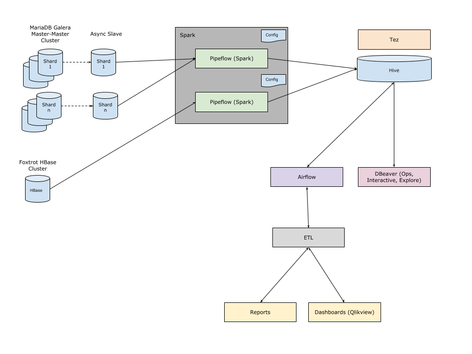

## Problem:

Since we weren’t raising any events for business metrics from the application, we had to get this data by querying the database.

Considering the number of rows that had to be scanned and the transformation of data (Parsing JSONs and flattening joined tables) for these metrics, it was not feasible to run these queries on the master shards, nor the replicas (Not cost-effective, replicas with lower resources would eventually result in replication lag).

## ETL Pipeline (Extract Transform Load) Implementation summary:

### Extract:

Source: Relational databases (10+ shards) – MySQL
Most of these data types were structured outputs, while others were semi-structured JSON.

### Transform & Load:

Converting heterogeneous data to a more structured format, by having a table for each view (Views are usually defined based on the business needs).
The transformation includes:

- Parsing JSON.
- Flattening JSON.
- Ensuring a view (table) has all the required columns, to avoid the use of JOINS.
- Remove duplicate entries.
- Define the columns that are to be indexed/ partitioned.

Initially, the destination datastore was AWS Redshift.
Redshift makes it simple and cost-effective to run high-performance queries on petabytes of structured data.

Data from MySQL databases (10+ shards) are now transformed to the defined views and inserted to Redshift, it is evident that this task has to be scheduled and performed often, for which we used Airflow

Talking in terms of Airflow, a dag is nothing by a python script, performing the following tasks.

- Select queries on read replicas of the master shards based on update_at timestamp.
- Transformation for data as per the business use-cases (Views).
- Insert data to AWS Redshift.

Some of these dags were preceded by an-other dag to refresh the user data which were dependent on external providers for being volatile.

The destination datastore was then moved to AWS Athena, which was cost-effective and faster query response time as compared to Redshift, as Athena is not charged for the storage, rather charged for the number of rows scanned (Pay per query).

The backing data store for Athena is AWS S3, for this reason, indexing would refer to the files directory structure in S3, hence, using 2 different indexes (Athena does not support indexing, it is rather referred to as partitioning) on the same table (Table is structured JSON files) is not possible and would require duplication of data, which is to create two different partitions for the same data set.

For most of our use cases, the data was partitioned by updated_at timestamp.

Here is an example of how Athena works.
Query: `SELECT dest, origin FROM flights WHERE year = 1991`
Partitions are stored in separate folders in Amazon S3, in this case, the data set is partitioned by year.

```
$ aws s3 ls s3://athena-examples/flight/parquet/
PRE year=1987/
PRE year=1988/
PRE year=1989/
PRE year=1990/
PRE year=1991/
PRE year=1992/
PRE year=1993/
```

At this point in time, there were dags to copy and transform data from MySQL to Athena and Redshift to Athena for backward compatibility.
Over time, there were 100+ dags running at a frequency ranging between every 15 minutes to 24 hours.

Although this concludes the summary of the implementation, there was a lot more features and abstraction on top of this:

- DAGs could be created by data/ business analysts from a retool dashboard.
- Over the course of time, data was almost realtime with delay less than 7 minutes, as we started using bin logs for data transfer instead of running select queries on the source databases.
- The project was further extended to send contextual notifications to customers.
- Powering reports which take longer processing time, such as the health check report.

 
<p style="text-align: center;">Hadoop-Ecosystem</p>