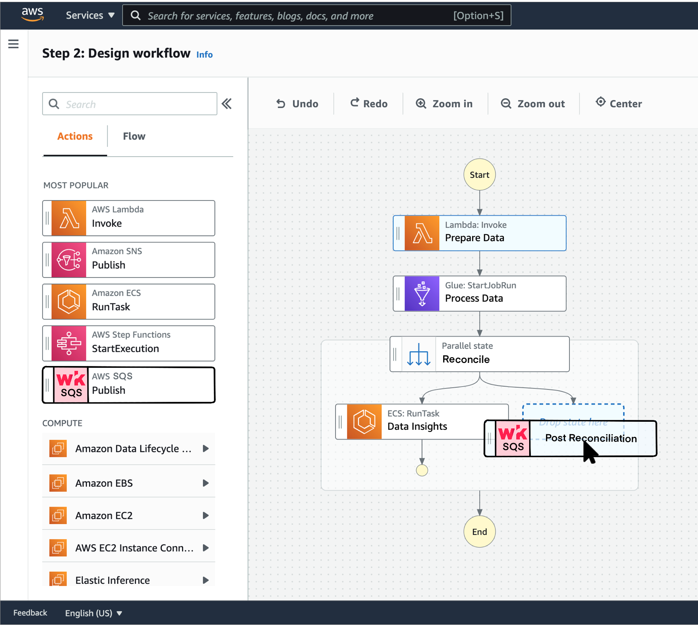

Hey 👋 I'm a Computer Science graduate student looking for a <b>full-time internship in Backend Engineering from August 2022</b>. I previously worked as a Backend Engineer in Walmart's PhonePe and YC ClearTax. For a better representation of my skills and experiences, my resume: [pyblog.xyz/about](https://pyblog.xyz/about).

## 1. Five Reasons to hire me?

- Actions over words: after understanding Wrk as a black box as an outsider, I came up with a proposal to simplify integration with Wrk; Refer to the Sections <b>2.1 and 2.2</b>
- I have the <b>skill and experience</b> to work in fast-growth and high-scale environments. For instance, at PhonePe, handling a scale to serve over [370+ million](https://www.phonepe.com/pulse/explore/transaction/2021/4/) B2C and B2B users in the fintech space primarily meant automating the legacy processes, managing 1000s of servers, and working with over a dozen micro-services among the 300+
- I am open to working <b>anywhere in Canada</b> or remotely.
- While improving technical skills goes unsaid, I constantly work towards my <b>soft skills</b> (Certified in "Business Communications for Researchers" and recently completed the "Exploring Entrepreneurship - Mentorship Program").
- I'm a budding <b>open source contributor</b>; one of the most recent projects is "Building a World Cartogram" for "Our World in Data." The prototype: [population cartogram](https://www.pyblog.xyz/population-cartogram/).

## 2. The Proposal

### 2.1. Software Development Kit (SDK)

Disclaimer: SDK(s) to manage wrkflows could be present already, but I could not find resources to affirm the same. 

To have better control over the different components and processes in a product, one of the must-have and go-to approaches is "as-code" (example: infrastructure as code), which translates to version control, review process, and ownership.

Let's take an example of [Claims & Request Processing](https://wrk.com/wrkflows/claims-and-request-processing/) in Java ([Builder Pattern](https://refactoring.guru/design-patterns/builder)) with an additional change to demonstrate parallel workflow:

```
ApiWrkAction verifyEligibility = new VerifyEligibilityWrkAction(<function-parameters>);
ApiWrkAction verifyAmount = new VerifyAmountWrkAction(<function-parameters>);
ApiWrkAction classifyExpense = new ClassifyExpenseWrkAction(<function-parameters>);
EmailWrkAction emailToFinance = new EmailWrkAction(<function-parameters>);
EmailWrkAction emailToEmployee = new EmailWrkAction(<function-parameters>);

WrkFlow wrkflow = SequentialWrkFlow()
        .name("Claims & Request Processing")
        .execute(verifyEligibility)
        .then(verifyAmount)
        .then(ConditionalWrkFlow()
                .execute(classifyExpense)
                .when(Predicate.APPROVED)
                .then(ParallelWrkFlow()
                        .execute(emailToFinance, emailToEmployee)
                        .build())
                .otherwise(EmailToEmployee)
                .build())
        .build();
```

Where `VerifyEligibilityWrkAction`, `VerifyAmountWrkAction`, `EmailWrkAction` and `ClassifyExpenseWrkAction` are activities/actions, the building block of a wrkflow and extends the pre-configured wrk-actions such as `ApiWrkAction` and `EmailWrkAction`, in this context an activity/action by itself can be a Wrkflow. The `WrkAction` internally makes API calls to the Wrk server with the required parameters (The typical SDK way of making API calls).

<b>2.1.1. Advantages</b>:
- Offers easy maintenance of Wrkflows (to clients).
- Integration with existing systems is easier (as simple as adding a dependency and defining workflows).
- Clients can have a layer of abstraction on Wrkflows, thereby giving better flexibility to choose a different provider (although this sounds counter-intuitive, it always works in favor).

<b>2.1.2. Disadvantages</b>:
- Requires constant development, support, and maintenance.
- Not limited to a language, typically 5-6 languages (Go, Java, Node.js, Python, Ruby, and .NET).

### 2.2. Integration with the existing workflows management tools.

After exploring a broad range of [wrk-actions](https://wrk.com/wrk-actions/) and given that the cloud infrastructure provider AWS, Azure, and Google Cloud has a market share of 33%, 22%, and 9%, respectively, let's take an example: 

Alex runs a tax filing business and uses [AWS](https://aws.amazon.com/) as the cloud provider; [AWS Step Functions](https://aws.amazon.com/step-functions) as the workflow orchestrator.

An existing workflow - collects the data and performs reconciliation between sales and purchase records. After the reconciliation, the top-3 action items are:
- Reaching out to the supplier(s) for clarification/correction.
- Consulting the Chartered Accountant to link/de-link invoices based on the match results.
- Fixing the ITC (Input Tax Credits) claims.

Alex is well aware of several other similar use-cases and wants to offer better flexibility to the finance team to decide on the action items and is looking for products that can be easily integrated with the existing system. Not to mention, Alex's topmost priority is high confidentiality and security.

Jan is a Relationship Manager at Wrk who has been in talks with Alex and finally struck a deal! <b>How did they do it?</b>

- The client integrated with Wrk's [SQS](https://aws.amazon.com/sqs/) (Amazon Simple Queue Service) queue(s) within the AWS network using the [VPC endpoint](https://docs.aws.amazon.com/vpc/latest/privatelink/vpc-endpoints.html) ([AWS Private Link](https://docs.aws.amazon.com/vpc/latest/privatelink/integrated-services-vpce-list.html)), thereby reducing network bandwidth and offering higher security as the communication is within the private network.
- Wrk's consumer pool reads the messages in the queue and initiates the intended wrkflow(s).
- For Alex, any further integration with Wrk is as simple as a Drag and Drop in the Step functions console or, in a more general construct, use the Wrk's SQS as the trigger to start a pre-configured workflow.

Below is an illustration of the ease of integration in the AWS Console:

 
Note: 
- The "Wrk SQS" card is for illustration only, and in the real console, it would be an AWS SQS card.
- The assumption is that Wrk uses AWS for this scenario, but not necessarily a constraint.

Alex is more than happy to know that the finance team is in complete control to do what's best for the customers, while the engineering team dedicates their bandwidth to what makes them stand out, their proprietary reconciliation tool.

The above example is not limited to a cloud provider or a specific workflow management tool but rather an example of how integrating existing workflows with Wrk can be easy, secure, and fast.

<b>2.2.1. Advantages</b>:
- Lower network bandwidth for clients using the same cloud provider.
- Ease of integration with the existing architecture.

<b>2.2.2. Disadvantages</b>:
- Not limited to a workflow orchestration tool or a cloud provider. However, a better way to decide is based on contracts with the potential premium client(s).
- Higher cost and maintenance of additional resources.

## 3. Why work at Wrk?

Working in a company is a two-way street, the main reason why I want to work at Wrk:

<b>Addressing the right problem</b>: With more and more companies coming into the digital space and existing companies giving at most importance to customer experience, "automation" is the way to scale and solve. Every company out there has a workflow. The no-code/less-code approach to defining these workflow(s) so companies can work towards the betterment of the kernel of their product is the way forward for many.

That said, the need for constant innovation and skilling-up at Wrk goes unsaid. A checklist of Fast-growing, customer-first, remote-first - Wrk tops them all.

## 4. Links (About me)

- Resume: [pyblog.xyz/about](https://pyblog.xyz/about)
- Github: [@addu390](https://github.com/addu390)
- Blog: [pyblog.xyz](https://pyblog.xyz/)
- Medium: [pyblog.medium.com](https://pyblog.medium.com/)
- LinkedIn: [@adesh-nalpet-adimurthy](https://www.linkedin.com/in/adesh-nalpet-adimurthy/)
- Twitter: [@gooshi_addu](https://twitter.com/gooshi_addu)
- LinkTree: [thenextbigproject.com](http://thenextbigproject.com/)

Fun fact: I have now added "Wrk" to my dictionary.


