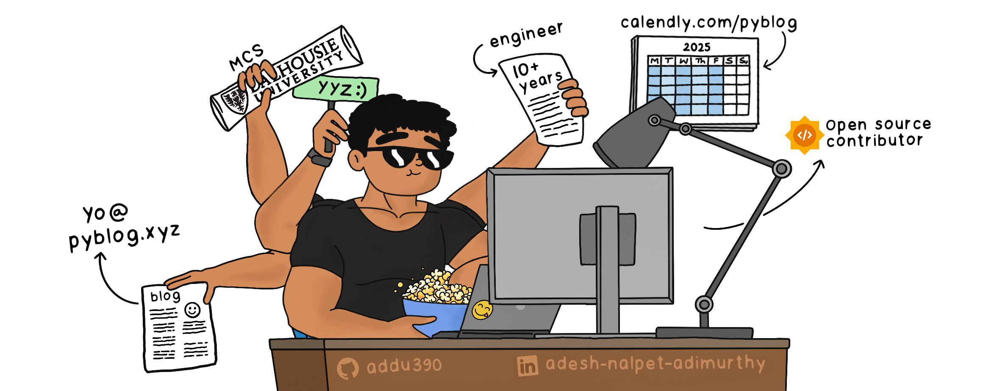

    <h1 style="display: inline-block; margin-top: 0px;">The PyBlogger</h1>
    
Balancing code , creativity , and cardio  – that's my life as a software engineer, artist, and fitness buff; 

Since the end of 2023, I've been exploring the integration of videos and blogs. If you're like me and prefer reading documentations over watching videos but still appreciate visual aids, you're in the right place! <a class="underline" href="/">Pyblog</a> posts are rich with images and detailed explanations to help bridge the gap between text and visuals.

     

A Peek into My World

<ul>
<li>My playlist is a blast from the past, mostly rock legends like the Eagles, Rolling Stones, Guns N' Roses, Led Zeppelin, and Nirvana. I swear, my Spotify thinks it's 1975.</li>
<li>I like to climb rocks and ropes. Otherwise, I'm lifting heavy things at the gym and pretending it's fun.</li>
<li>I get giddy about new startups and tech. Watching the industry evolve is like binge-watching a sci-fi series, but with more (new) acronyms.</li>
<li>The obvious; Pencil sketching and illustrating!</li>
<li>I talk to my plants. I think they listen. Bird of Paradise, Pothos, Clementine, and Parlor Palm are my buddies.</li>
<li>Currently obsessed with time and spatial indexes.</li>
</ul>

<iframe style="border-radius:12px;" src="https://open.spotify.com/embed/playlist/7cC4dvGOD3LCBxKJTFdxLC?utm_source=generator&theme=0" width="50%" height="152" frameBorder="0" allowfullscreen="" allow="autoplay; clipboard-write; encrypted-media; fullscreen; picture-in-picture" loading="lazy"></iframe>

Recent Brags:

<ul>
    <li>Revamped PyBlog with my top-of-the-line illustrations, algorithm visualizers, concept explanation series, and much more.</li>
    <li>Rock Climbing: Can Send V6 on a good day  </li>
    <li>At the Gym: Shoulder Press 165, Bench Press 235, Squat 315 and Deadlift 405 </li>
</ul>

 &nbsp;Trailblazing My Way in Software Engineering

I have worked in companies with as few as 3 engineers, as well as mid and large-sized startups, and major enterprises.
 
My work is often centered around building asynchronous near-real-time workflows and pipelines, optimizing infrastructure, and developing libraries and microservices to streamline development, enchance maintainability and scalability.
 
     

 
