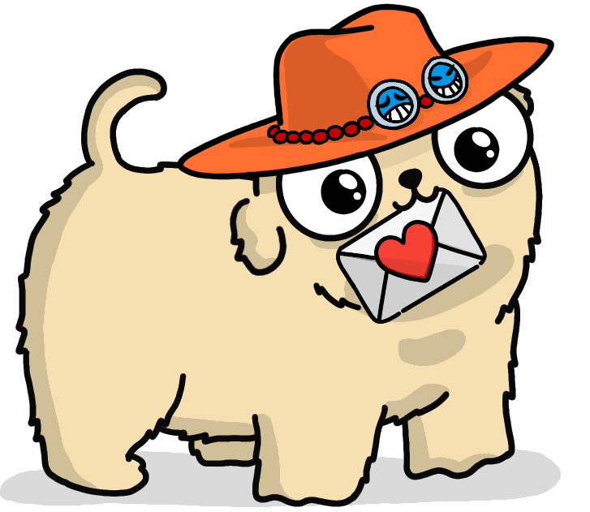
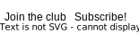

Follow updates on <a class="underline" href="https://dev.to/pyblog" target="_blank">@dev.to/pyblog</a> and <a class="underline" href="https://pyblog.medium.com/">@pyblog.medium.com</a>

Subscribe to the RSS feed at <a href="" target="_blank" class="underline">@pyblog.xyz/feed.xml</a>

Prefer a more personal touch? Sign up for the newsletter  below.

    
    

  

