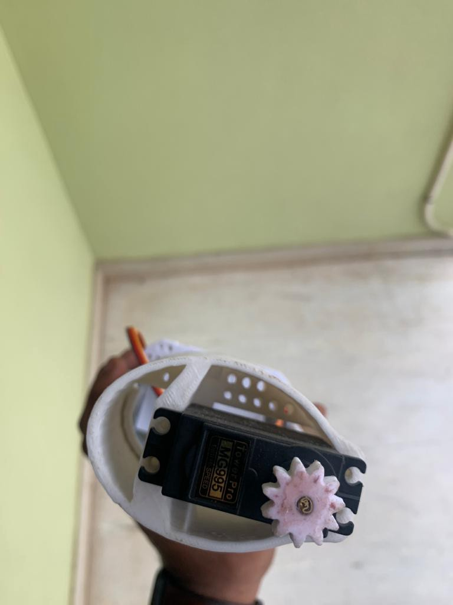
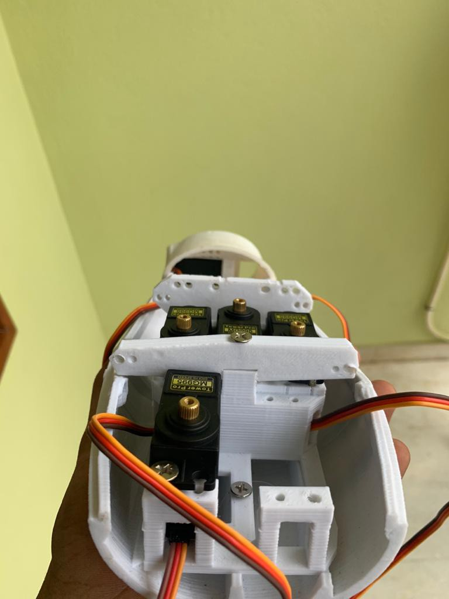
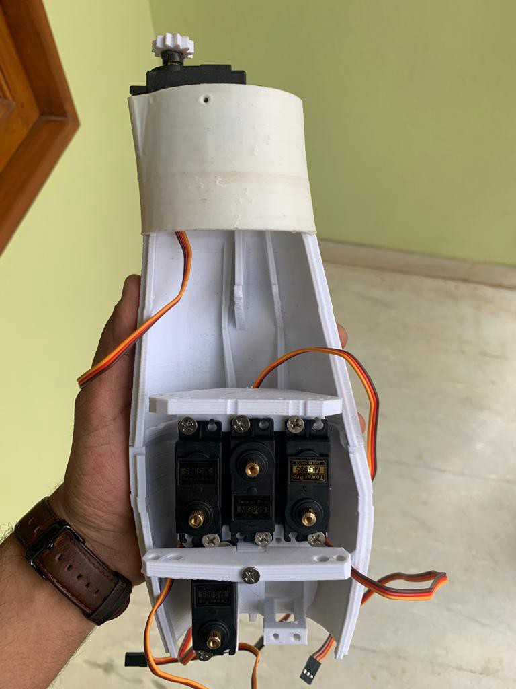
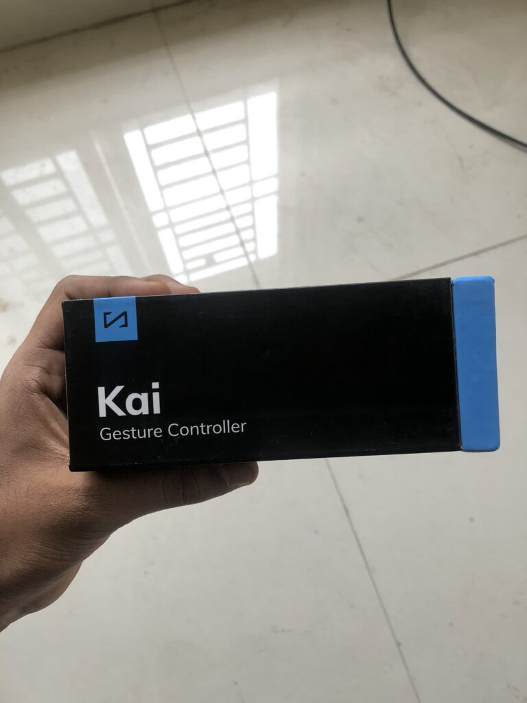
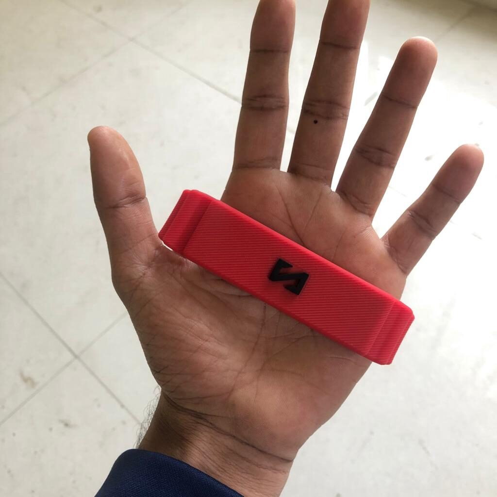
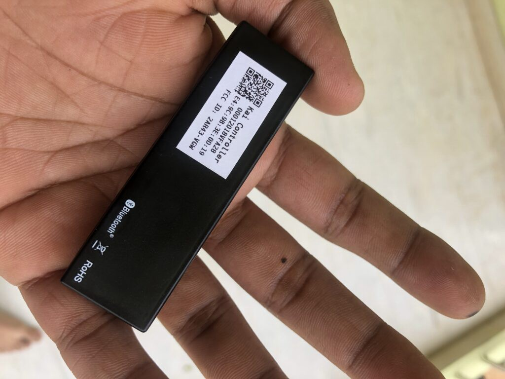
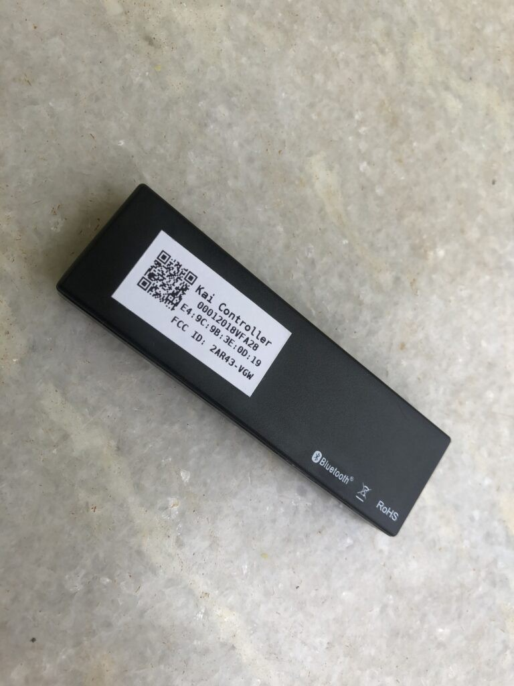
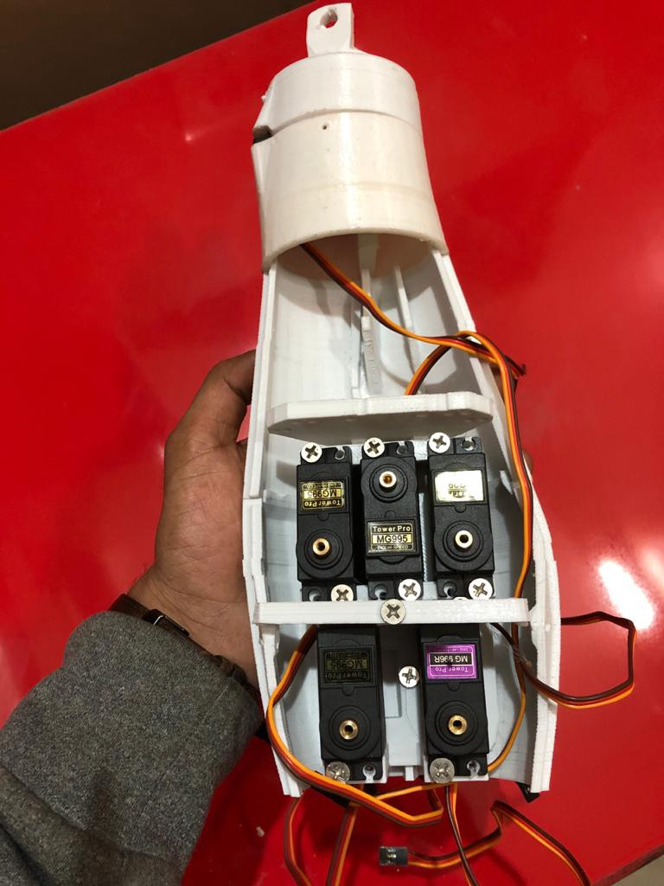
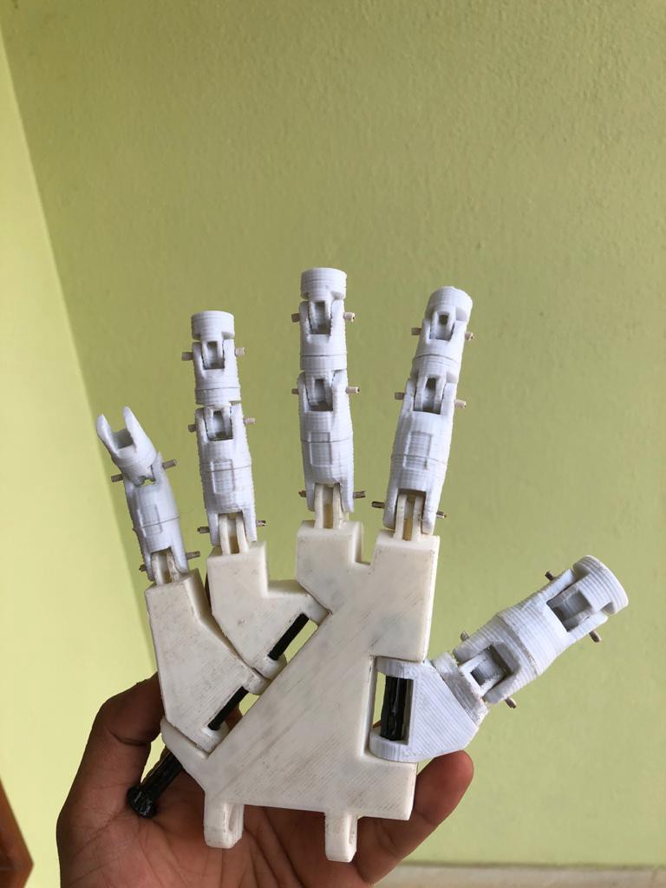

 

MYRO 2.0 — Ironman with Prosthetics 🤪

# Deprecated ⛔️

## Resources

- [Pattern Recognition ](https://github.com/addu390/emg-data-analysis)(sEMG Feature Extraction)

- [Myo Band Library](https://github.com/addu390/myro) (Deprecated)

- [KAI Motion Tracker](https://github.com/addu390/motion-tracking-kai-python)

- [MYRO](https://myro.in/) (Timeline)

## Introduction

[Wikipedia](https://en.wikipedia.org/wiki/Electromyography) — **Electromyography** (EMG) is an electrodiagnostic medicine technique for evaluating and recording the electrical activity produced by skeletal muscles. EMG is performed using an instrument called an electromyograph to produce a record called an electromyogram

## EMG Sensor 
A Sensor that measures small electrical signals generated by the muscles when we move them, such as movements of fingers, lifting your arm, tensing your fist, among others.

- It all starts with the brain. Neural activity in the motor cortex of the brain signals the spinal cord.
- The signal is conveyed to the muscle part via motor neurons, which innervate the muscle directly, causing the release of Calcium ions within the muscle and ultimately creating a mechanical change.
- This change involves depolarization, which is detected by EMG for measurement.

The electrodes of the surface EMG sensor(s) are placed on the muscles' innervation zone; these electrodes detect electrical activity generated by muscle relaxation/contraction. The output of the sensor is a voltage, which is further amplified.

## Broadly there are [two types](https://en.wikipedia.org/wiki/Electromyography#Surface_and_intramuscular_EMG_recording_electrodes)

- Surface EMG sensors (sEMG)
- Intramuscular EMG sensors.

## EMG pattern recognition methods using data analytics

Recognition of hand movements using sEMG signals generated during muscle contraction/relaxation is referred to as EMG Pattern Recognition.
EMG Pattern Recognition has a wide range of applications, one among them being upper-limb prostheses.
But because of the advancements in sEMG and its applications (Gesture Control being an important one), capturing and analyzing the EMG data is progressing towards the use of "Big Data Analytics" to translate the vast and complex information in EMG signals into useful data for prosthetic devices.

## How does my project currently work?

### Data Collection

Collect raw EMG signal data (Output of the EMG sensor), apply digital filters above a raw EMG signal, and then extract [time and frequency](https://en.wikipedia.org/wiki/Time%E2%80%93frequency_analysis) features using the sliding window method.
Data Collection is the most critical aspect of pattern recognition. A large dataset is preferred to understand the variability of the raw sEMG signals. I collected data from two different individuals (and utilized datasets shared by other researchers and groups):

- An amputee with the right arm was amputated about five years back (minimal usage of the amputated hand).
- A swimmer by profession who lost his right hand in an accident.

Data from hundreds of subjects would be ideal for a comprehensive generalization and robustness of EMG pattern recognition for myoelectric control. But I could not find a dataset or a collection of datasets of that scale. The other reason for not gathering a more extensive dataset was that different researchers use different scales, units, and equipment types. Not to mention the difference in electrode placement, since I used the MYO band from Thalmic labs — an array-like order of the electrodes placed over the muscle area (Such as forearm and biceps). But this does not mean that increasing the number of electrodes increases the number of patterns we can identify. The placement of the electrodes in the right position takes higher importance in the first place.

### Multiple Modalities

The arm's motion can be identified in several ways, one of them being Electromyography.
What do I mean by that? — analysis of only the surface EMG signals is considered the analysis of a single modality. While there are various ways to detect hand motions, as mentioned, since I used the Myo band, it was already equipped with a 9-Axis motion tracker (3 Axis Accelerometer, 3 Axis Gyroscope, and a 3 Axis Compass). Therefore, pattern recognition is based on the data from sEMG sensors and the 9 Axis motion tracker.

### Technique
The pattern recognition system consists of the following steps: Data pre-processing, feature extraction, dimensionality reduction, and classification.

Feature extraction (based on the time domain, frequency domain, and time-frequency domain) to transform short time windows of the raw EMG signal to generate additional information and improve information density is required before classification.

Giving an example of features in the time domain: Most commonly used for EMG pattern recognition as they are easy and quick to calculate as they do not require any transformation. Time-domain features are computed based upon the input signals amplitude.

[Features](https://www.researchgate.net/figure/A-list-of-EMG-feature-extraction-techniques_tbl1_321598414): integrated EMG (IEMG), mean absolute value (MAV), mean absolute value slope (MAVS), Simple Square integral (SSI), variance of EMG (VAR), root mean square (RMS), waveform length (WL), and many more.

    features_names = ['VAR', 'RMS', 'IEMG', 'MAV', 'LOG', 'WL', 'ACC', 'DASDV', 'ZC', 'WAMP', 'MYOP', "FR", "MNP", "TP",
                      "MNF", "MDF", "PKF", "WENT"]

[View on Github](https://github.com/addu390/emg-data-analysis)

But the challenge is with the selection of an optimal combination of available features. Although this might seem easy for a small dataset, it is not feasible for big data to try out all the possible combinations.

[MYRO](https://myro.in/) 2.0 — My Robotic Arm is back!
### Objective 
Re-design techniques for Big EMG Data to improve pattern recognition.

MYRO initially started as a wearable motion tracking unit, which eventually evolved to use it with prosthetics (Final year project at Dayananda Sagar College of Engineering) — I launched MYRO (Myro Labz Pvt Ltd) back in August 2017.
For more details regarding the project, refer to the [MYRO](https://myro.in/) website and [Github](https://addu390.github.io/myro/).

To keep the vision alive and resume my work on the project, I recently got the [InMoov](https://inmoov.fr/) right-hand 3D printed (I know what you are thinking; I'm using InMoov for representation purposes as a prototype.

Top View          |  Front View
:-------------------------:|:-------------------------:
  |  

Side View          |  Front View - 2
:-------------------------:|:-------------------------:
  |  

Compared to the first version of MYRO, the 3D printed ARM had 5 DOF (Degree Of Freedom) DC motors for individual finger movement (spools and gears). The [InMoov arm](https://inmoov.fr/hand-and-forarm/), on the other hand, is heavier and uses servo motors and strings as the driver, which isn't very reliable.
Furthermore, MYRO 1.0 was primarily based on Myography, which used a combination of surface EMG sensors, a gyroscope, and an accelerometer (6 Axis motion tracking). The more refined version of the project used the [MYO Band](https://www.amazon.com/Thalmic-Labs-Gesture-Control-Presentations/dp/B00VHWBH02) (9 Axis motion tracking) from Thalmic labs. Unfortunately, project MYO was canceled and is now called [byNorth](https://www.bynorth.com/) (Acquired by Google).

The major disadvantage of the MYO band was that EMG sensor signals were poor when the residual arm was not actively used by the user, which was the very reason to rely more on the 9 Axis motion tracker.
While looking for other alternatives to Myo Band in the market, I came across [KAI](https://vicara.co/vicara-motion-engine) from [Vicara](https://vicara.co/about).

Kai Controller Box         |  Kai Controller - 1
:-------------------------:|:-------------------------:
  |  

Kai Controller Inside - 2         |  Kai Controller Inside - 3
:-------------------------:|:-------------------------:
  |  

The plan is to use a combination of Surface EMG sensors and KAI (Gyroscope, Accelerometer, and Magnetometer).

3D Printed Prosthetic Improvements - 1         |  3D Printed Prosthetic Improvements - 2
:-------------------------:|:-------------------------:
  |  

- Servo motors (Amazon purchase links): [MG995](https://www.amazon.in/Easy-Electronics-Set-TowerPro-MG995/dp/B07M5NJT2L) and [MG996R](https://www.amazon.in/TowerPro-MG996R-Torque-Robotics-Arduino/dp/B072KGJL9H)

- Prosthetic Hand: [InMoov 3D printed parts](https://www.amazon.in/Hand-Robot-InMoov-Printed-Parts/dp/B07L375GT4)

- Motion Tracker: [KAI Gesture Controller](https://store.vicara.co/products/kai-gesture-controller) — Unfortunately, KAI developer support and community are close to NIL and inactive.

- Servo Tester: [Steering Gear Tester Servo Motor Tester](https://www.amazon.in/dp/B019DORFME/ref=cm_sw_em_r_mt_dp_lcfIFbK85SHE0)

- [MPU9250 9 Axis Motion Tracker](https://www.amazon.in/Robocraze-MPU-9250-GY-9250-9-axis-sensor/dp/B07HF782LD) — Worth a try!

3D Printed Upper Prosthetic Arm - 1         |  3D Printed Upper Prosthetic Arm - 2
:-------------------------:|:-------------------------:
  |  

- [Adafruit 9 DOF IMU Fusion Breakout](https://www.tenettech.com/product/adafruit-9-dof-orientation-imu-fusion-breakout-bno085-bno080-stemma-qt-qwiic) — The best in class 9 Axis motion tracker.

- [Seeed Studio EMG Grove](https://www.seeedstudio.com/Grove-EMG-Detector-p-1737.html)

**Note:** MYRO 2.0 is no longer in active development. Drop me a [message](https://thenextbigproject.com/contact/) — With any questions about the project.
