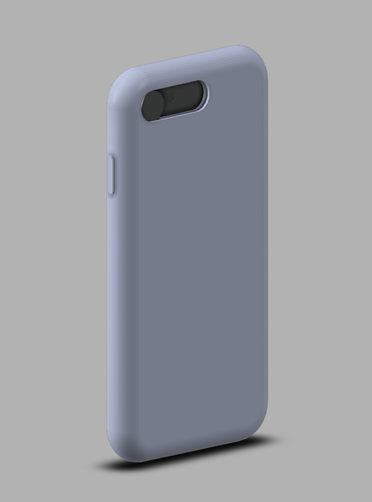

 

You are being watched 🤨 — Totoro

“Should You Cover Your Smartphone Camera?” is a question trending since 2015 🤭

Covering laptop cameras with a piece of tape/slider to prevent surveillance is a common cybersecurity practice.

However, most of us fail to follow the same practice with smartphones. Naked smartphone cameras are more vulnerable as smartphones accompany us everywhere, from the boardroom to the bathroom and bedroom, leaving open the potential for even more susceptible moments to be caught on camera without anyone being aware.

Objectively, there are more reasons to cover smartphone cameras than laptop cameras.
Furthermore, most laptops have a tiny red LED indicating us when the camera is on, and smartphones did not, but the recent update on IOS and Android, a tiny dot appears in the top right corner of the phone’s display. If it’s green, it means that an app is using your camera.

In early November of 2019, Google confirmed an Android Smartphone Camera vulnerability discovered in July 2019 that affected millions of users, including Google Pixel and Samsung devices, allowing hackers to eavesdrop on someone. Another vulnerability was revealed in the same month when Facebook acknowledged that a bug let the social network’s app access users’ [iPhone cameras as they scrolled through their News Feeds](https://indianexpress.com/article/technology/social/facebook-bug-secretly-accesses-iphones-camera-when-users-scroll-through-news-feed-6117235/) (that’s very creepy for a bug) 🤯

Both companies (Google and Facebook) have patched their bugs and rolled out updates. Still, vulnerabilities such as these are an excellent indicator to cover smartphone cameras.

As an individual, even if I’m convinced to cover your smartphone camera, there are not many alternatives available in the market to cover both the front and rear cameras of the smartphone.
One way is to use a camera patch/slider and a rear camera protection case (usually available for iPhones and limited Samsung models).

For this very reason, I’m designing a phone case that can be 3D printed. Like any other design, it all starts with a prototype 🧪

Prototype V1 - 1          |  Prototype V1 - 2
:-------------------------:|:-------------------------:
  |  

Figure 1: Fusion 360 Phone Case Design Version 1

While the above design serves the purpose, it has three major drawbacks:

- First, in the Front view, the bottom sliding track is delicate and expands over time, hampers the slider’s easy movement.

- The slider movement in the sliding track is not locked, resulting in the slider’s unintended movements.
- To know if both rear and front cameras are covered, one has to flip the smartphone every time to check.

In the following design, I will be fixing all of the above drawbacks. Stay tuned!

Prototype V2 - 1          |  Prototype V2 - 2
:-------------------------:|:-------------------------:
  |  

Figure 2: Fusion 360 Phone Case Design Version 2

Prototype V2 - 3          |  Prototype V2 - 4
:-------------------------:|:-------------------------:
  |  

Figure 3: Fusion 360 Phone Case Design Version 2 — 3D Print

The current design is not cost-friendly, and hence I will be re-designing to separate the camera cover slider (Rigid) and the silicone case (Flexible).

Although a typical silicone phone case costs about ₹200 (Manufacturing cost in bulk being ₹50), using techniques such as Vacuum Casting and Injection Moulding can be pretty expensive (~₹1000 per piece).
As a way easy out, I decided to manufacture only the slider mechanism and outsource the silicon case with a specific opening cut as per requirement.

Prototype V3 - 1          |  Prototype V3 - 2
:-------------------------:|:-------------------------:
  |  

Figure 4: Fusion 360 Phone Case Design Version 4

Since the partial case (as shown in the above figure) with the sliding mechanism is placed directly on the phone, the material is not rigid and moderately flexible.
To be explicit, a silicon phone case would be placed on top of it.

Prototype V4 - 1          |  Prototype V4 - 2
:-------------------------:|:-------------------------:
  |  

Figure 5: Fusion 360 Phone Case Design Version 5

Prototype V4 - 1          |  Prototype V4 - 2
:-------------------------:|:-------------------------:
  |  

Figure 6: Fusion 360 Phone Case Design Version 5–3D Print

I have placed the prototype on the iPhone 8 for the sake of reference, and the actual placement would be on a phone case with an opening to place the upper step of the camera cover.

Well, at the end of it, it was a fun project to work on, and more importantly, understanding the complexities in prototyping and factors to consider to launch it to an open market was worth the time spent 🚀

Ohh yeah 🤪, I did sell a few at [eagle-eye-iphone-8](https://thenextbigproject.com/product/eagle-eye-iphone-8/)